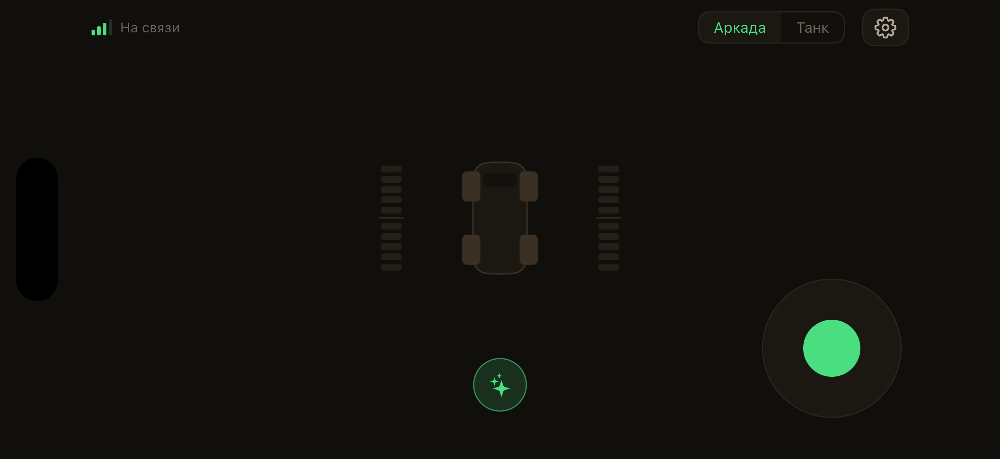
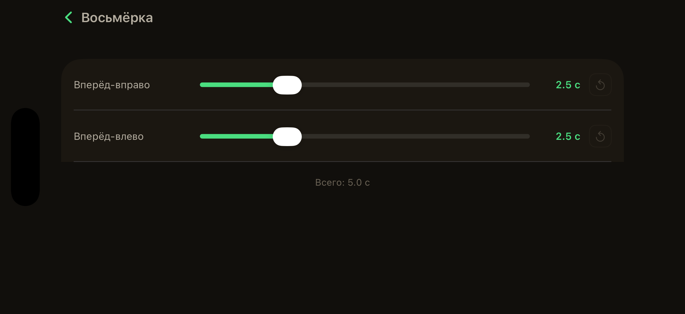
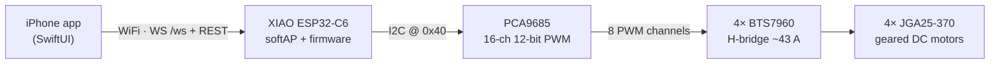
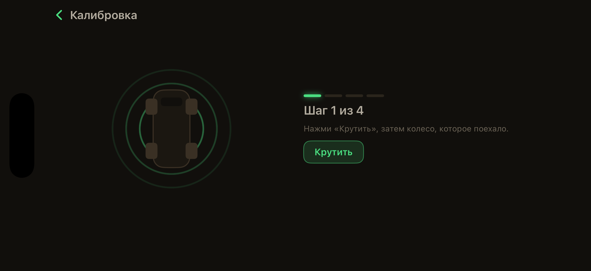
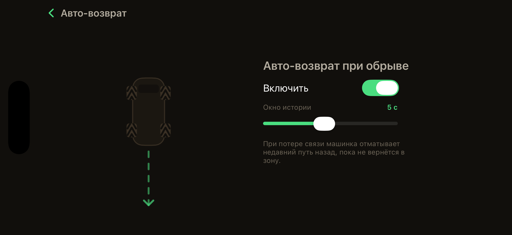
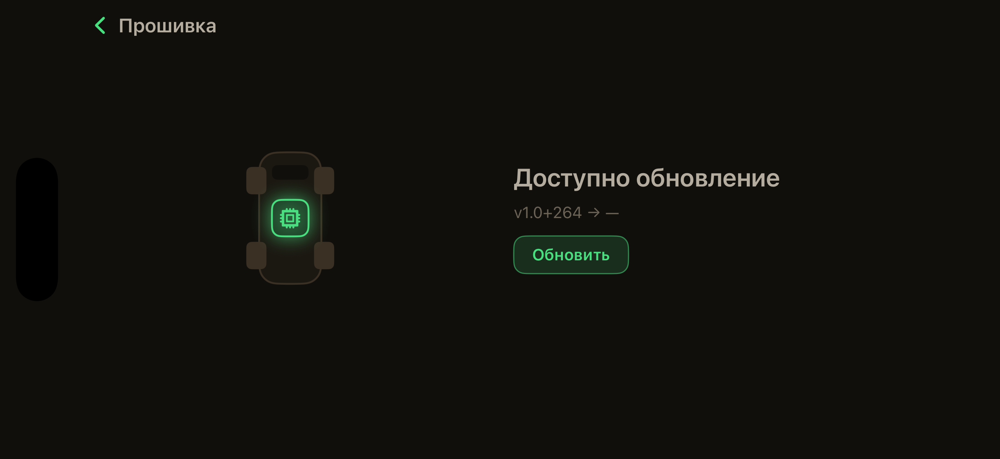
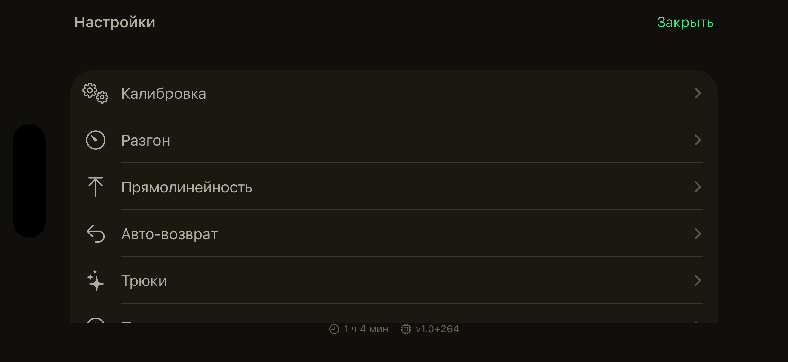
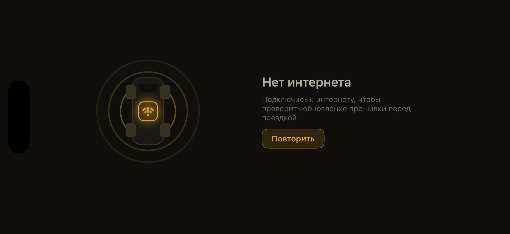
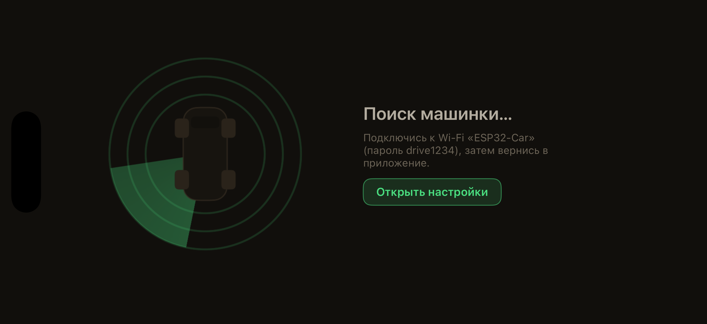

# AJPicoCar

### Seeed XIAO ESP32-C6 · 4WD RC car · tank-turn, realtime joystick control, native iOS pult


A WiFi-controlled four-wheel-drive RC car. The board hosts its own WiFi access point and a REST/WebSocket API
that a native SwiftUI iOS app drives — tank-turn mixing, on-wheels motor calibration, a control-link watchdog,
link-loss auto-return, one-tap trick macros, and in-app over-the-air firmware updates from GitHub Releases.

<table>
  <tr>
    <td align="center"><br/><sub><b>Drive</b> — joysticks · predicted-trajectory diagram · tricks ✦</sub></td>
    <td align="center"><br/><sub><b>Trick editor</b> — per-action duration</sub></td>
  </tr>
</table>

> Russian-localized UI · warm light/dark themes · landscape-locked. The whole flow iterates hardware-free
> against a localhost mock car in the iOS Simulator.

## Features

- **4WD tank-turn mixing** — `mix <throttle> <yaw>` blends into left/right side speeds (`left=t+y, right=t-y`, normalized), shoot-through-safe by construction
- **Realtime control** — WebSocket `/ws` streaming `"t,y"` at 10 Hz; thread-safe `car_drive` (I2C mutex)
- **Control-link watchdog** — 50 Hz timer; no control frame for >300 ms → `car_stop()` (console `mix` is exempt)
- **Link-loss auto-return** — `recovery.{c,h}` keeps a breadcrumb buffer of recent commands; on link loss the watchdog replays it in reverse to retrace the car back into range (configurable 1–10 s window + on/off via `GET/POST /recover`; iOS «Авто-возврат» screen)
- **On-wheels calibration** — spin each motor pair, tap the wheel that turned, pick direction, save to NVS; loads-or-defaults on boot
- **Tricks** — one-tap maneuver macros (spin / figure-8 / wiggle / donut) streamed from the app over `/ws` (no firmware change); joystick touch interrupts; ⏹ + a trick-time progress ring; an editor to tune the duration of each distinct movement (0.1–10 s); the Drive diagram + power bars visualize the running maneuver
- **Adjustable donut + trajectory sim** — the donut trick exposes a **circle-diameter** slider and an integer **circle-count** stepper; a pure inverse solver maps them to the streamed `(t, y, ms)`, and an animated top-down trajectory simulation (`TrickSim`) previews the swept path / revolutions / area in the editor
- **Car dimensions** — set the car's **track** (колея) + **wheelbase** (база) between wheel centres on an animated top-down diagram, stored on the car via `GET/POST /dims`; a mandatory setup-wizard step. The measured track feeds the donut/turn geometry and the simulation
- **Launch gate + OTA** — the app checks the internet, fetches the latest firmware from GitHub Releases, connects to the car, and force-updates it over `POST /ota` if the on-board build is older — then drives
- **Firmware versioning** — `v<semver>+<build>` (build = git commit count), set in CMake `PROJECT_VER`; `tools/release.sh` cuts a GitHub release; the app compares the numeric build
- **`GET /status` + WS telemetry** — signed identity (`{"device":"esp32-car","fw":..,"uptime_s":..,"calibrated":..,"heap":..}`) for the app's "am I on the car?" check, plus 5 Hz telemetry pushed over `/ws`
- **WiFi softAP** — `ESP32-Car` (WPA2), `http://192.168.4.1`; no internet/captive portal — join and open the app
- **Pure, host-tested modules** — `mixer` / `motors` / `control_proto` / `watchdog` / `calibration` / `recovery` compile with plain `cc` and run on the host (`cd test && make run`)
- **Hardware-free iOS dev loop** — run the app in the iOS Simulator against a localhost mock car (`tools/mock_car`); `CarHost` auto-targets localhost in the simulator and `192.168.4.1` on device

## How it works



The phone holds the control link: it streams the held `t,y` command at 10 Hz over the WebSocket. The firmware
mixes it into per-side speeds, plans per-channel PWM (shoot-through-safe), and writes the PCA9685. If frames
stop, the watchdog steps in (stop, or replay-in-reverse auto-return).

## Screenshots

<table>
  <tr>
    <td align="center"><br/><sub>On-wheels calibration wizard</sub></td>
    <td align="center"><br/><sub>Link-loss auto-return</sub></td>
  </tr>
  <tr>
    <td align="center"><br/><sub>In-app OTA update</sub></td>
    <td align="center"><br/><sub>Settings</sub></td>
  </tr>
  <tr>
    <td align="center"><br/><sub>Launch gate — no internet</sub></td>
    <td align="center"><br/><sub>Connecting (radar search)</sub></td>
  </tr>
</table>

## Hardware

| Component | Details |
|-----------|---------|
| MCU | [Seeed Studio XIAO ESP32-C6](https://wiki.seeedstudio.com/xiao_esp32c6_getting_started/) (RISC-V, WiFi 6, native USB — no UART bridge) |
| PWM driver | PCA9685 16-ch 12-bit (I2C `0x40`, Osoyoo board) |
| Motor driver | 4× BTS7960 full H-bridge (~43 A) |
| Motors | 4× JGA25-370 geared DC motors |
| Battery | 3S3P 18650 pack (9.0–12.6 V) |
| Framework | ESP-IDF 5.4 |

### Pin mapping (XIAO ESP32-C6 → PCA9685)

| Pin | Function |
|-----|----------|
| D4 (GPIO22) | I2C SDA |
| D5 (GPIO23) | I2C SCL |
| 3V3 | PCA9685 VCC (logic) |
| VBUS (5V) | PCA9685 V+ (feeds BTS7960 R_EN/L_EN) |
| GND | common with battery & BTS7960 |

### Motor channel mapping (2 channels per motor, stride 2)

| Motor | CH_A (forward) | CH_B (reverse) |
|-------|----------------|----------------|
| 1 | CH0 | CH1 |
| 2 | CH2 | CH3 |
| 3 | CH4 | CH5 |
| 4 | CH6 | CH7 |

Forward = CH_A high / CH_B low; reverse = swap. **Never both high** (BTS7960 shoot-through) — `motors_plan` makes this structurally impossible.

## Build & flash (firmware)

System Python is 3.14 but the IDF 5.4 venv is 3.13 → shadow it before sourcing:

```bash
mkdir -p /tmp/py313bin && ln -sf /opt/homebrew/bin/python3.13 /tmp/py313bin/python3
export PATH=/tmp/py313bin:$PATH
source ~/esp/esp-idf/export.sh
idf.py build
idf.py -p /dev/cu.usbmodem* flash      # USB port number changes after each reset
```

Console (USB Serial JTAG): `mix <throttle> <yaw>`, both floats in `[-1, 1]` (e.g. `mix 1 0` forward, `mix 0 1` spin).

## Host tests

```bash
cd test && make run     # pure modules with plain cc: mixer, motors, control_proto, watchdog, calibration, ramp, trim, telemetry, recovery
```

## iOS app

XcodeGen project in `ios/` (landscape-locked, warm themes, Russian-localized). Talks to the same firmware
over WiFi/WS/REST.

- **On iPhone:** `open ios/ESP32Car.xcodeproj` → set a Team in Signing → Run; join WiFi `ESP32-Car`.
- **In the Simulator (no hardware):** start the mock car, then run for the simulator —
  ```bash
  cd tools/mock_car && python3 -m venv .venv && .venv/bin/pip install -r requirements.txt
  .venv/bin/python mock_car.py            # serves /status, /ws, /calib* on 127.0.0.1:8080
  ```
  Build/launch with `xcodegen generate` + `xcodebuild` + `xcrun simctl` (see `CLAUDE.md`). Launch with
  `--args -gallery` to open the debug screen gallery (every screen/state in one swipeable list).

On launch the app runs a gate — internet check → fetch/cache the latest firmware → connect to the car →
force-update over `POST /ota` if the on-board build is older → drive. All split screens share one `SplitScreen`
layout (consistent centring, custom headers).

## Code structure

`main/` (firmware) — `pca9685` (I2C driver), `mixer` (pure tank-turn math), `motors` (pure PWM planner +
calibration table), `car` (orchestration), `wifi_ap`, `http_server`, `ws_control`, `control_proto`, `watchdog`,
`recovery` (breadcrumb auto-return), `calibration`, `ramp`, `trim`, `telemetry`, and the REST layers
(`calib_api`, `status_api`, `ota_api`, `ramp_api`, `trim_api`, `recovery_api`), plus `main.c` (orchestrator +
console REPL). Pure modules have zero ESP-IDF deps and are host-tested.

`ios/ESP32Car/` (app) — `ControlModel` (pure scheme math), `CarConnection`/`CarStatus`/`CarHost` (link),
`DriveView` + `DriveDiagram`, the launch-gate screens (`AppFlow`, `NoInternetView`, `UpdateCheckView`,
`FirmwareView`), `SplitScreen` (shared layout), calibration, `RecoverView` (auto-return), and tricks
(`Tricks`, `TricksControl`, `TrickSettings`, `TricksSettingsView`).

Design docs, specs, and plans live under `docs/superpowers/`. Full architecture notes + gotchas are in `CLAUDE.md`.

## Roadmap

Firmware + the native iOS pult are done and hardware-verified, including in-app OTA updates from GitHub Releases
(launch gate force-updates a stale board). Next: a battery monitor (INA260 + 3S BMS → in-app SoC indicator), and
a migration to **ESP32-P4** (MIPI-CSI camera + hardware H.264) for low-latency FPV video to the pult (WiFi via a
companion ESP32-C6).

## License

[MIT](LICENSE) © 2026 Adam Johnson
